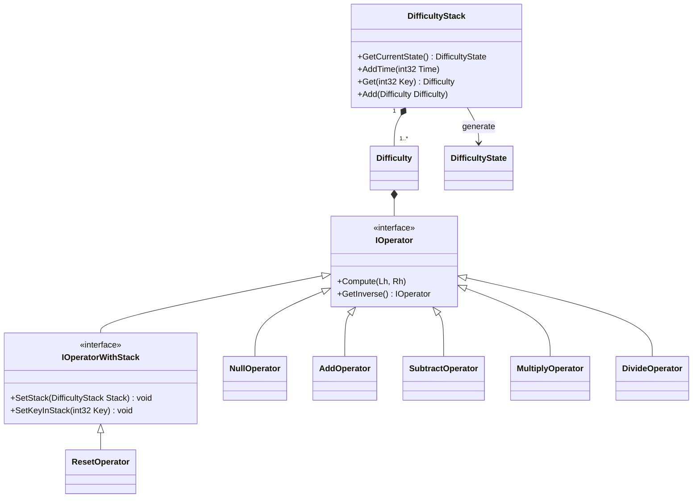
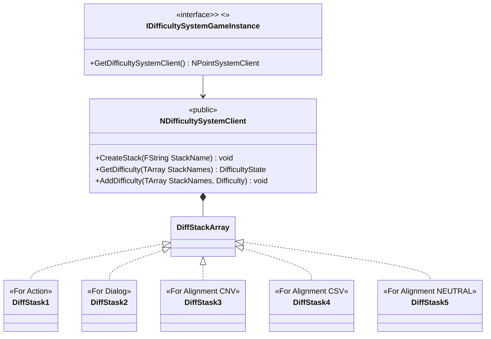

# Difficulty system

## Core structure

```mermaid
classDiagram

DifficultyStack "1" *-- "1..*" Difficulty
Difficulty *-- IOperator
DifficultyStack --> DifficultyState : generate
IOperator <|-- IOperatorWithStack
IOperator <|-- NullOperator
IOperator <|-- AddOperator
IOperator <|-- SubtractOperator
IOperator <|-- MultiplyOperator
IOperator <|-- DivideOperator
IOperatorWithStack <|-- ResetOperator

class IOperator {
    <<interface>>
    +Compute(Lh, Rh)
    +GetInverse() IOperator
}

class IOperatorWithStack {
    <<interface>>
    +SetStack(DifficultyStack Stack) void
    +SetKeyInStack(int32 Key) void
}

class DifficultyStack {
    +GetCurrentState() DifficultyState
    +AddTime(int32 Time)
    +Get(int32 Key) Difficulty
    +Add(Difficulty Difficulty)
}
```

## Exemple of how it works on client side

```mermaid
classDiagram
IDifficultySystemGameInstance --> NDifficultySystemClient
NDifficultySystemClient *-- DiffStackArray
DiffStackArray <|.. DiffStask1
DiffStackArray <|.. DiffStask2
DiffStackArray <|.. DiffStask3
DiffStackArray <|.. DiffStask4
DiffStackArray <|.. DiffStask5

class DiffStask1 {
    <<For Action>>
}
class DiffStask2 {
    <<For Dialog>>
}
class DiffStask3 {
    <<For Alignment CNV>>
}
class DiffStask4 {
    <<For Alignment CSV>>
}
class DiffStask5 {
    <<For Alignment NEUTRAL>>
}

class IDifficultySystemGameInstance {
    <<interface>>  <<public>>
    +GetDifficultySystemClient() NPointSystemClient
}

class NDifficultySystemClient {
    <<public>>
    +CreateStack(FString StackName) void
    +GetDifficulty(TArray<FString> StackNames) DifficultyState
    +AddDifficulty(TArray<FString> StackNames, Difficulty) void
}

```
