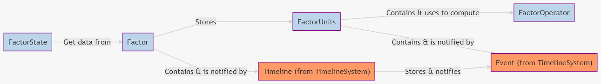

# Developers

Get the full documentation of the [API here](Api.md).

<!-- TOC -->

-   [1. Dependencies](#1-dependencies)
    -   [1.1. for docs](#11-for-docs)
-   [2. Design decisions](#2-design-decisions)
    -   [2.1. Core & UE4 separation](#21-core--ue4-separation)
-   [3. Implementation details](#3-implementation-details)
-   [4. How to override, create my own Factor, Factor Unit & Operator](#4-how-to-override-create-my-own-factor-factor-unit--operator)
    -   [4.1. Factor](#41-factor)
    -   [4.2. FactorUnit](#42-factorunit)
    -   [4.3. FactorOperator & OperatorProvider](#43-factoroperator--operatorprovider)
        -   [4.3.1. FactorOperator](#431-factoroperator)
        -   [4.3.2. OperatorProvider](#432-operatorprovider)
-   [5. Special case: Load game](#5-special-case-load-game)
-   [6. Testing](#6-testing)
    -   [6.1. Make Google Tests works](#61-make-google-tests-works)
-   [7. Notes](#7-notes)
-   [8. Contributing](#8-contributing)

<!-- /TOC -->

<a id="markdown-1-dependencies" name="1-dependencies"></a>

## 1. Dependencies

<a id="markdown-11-for-docs" name="11-for-docs"></a>

### 1.1. for docs

-   [node](https://nodejs.org/en/download/) + npm (installed by default with node-js)
-   [Doxygen](http://www.doxygen.nl/download.html)

> [What I used for API documentation](https://sourcey.com/articles/generating-beautiful-cpp-markdown-documentation-with-moxygen)

<a id="markdown-2-design-decisions" name="2-design-decisions"></a>

## 2. Design decisions

My goal was to create the most extensible plugin as possible and keep things simple and readable as inspired by [separation of concerns](https://en.wikipedia.org/wiki/Separation_of_concerns) philosophy and [SOLID principles](https://en.wikipedia.org/wiki/SOLID).

<a id="markdown-21-core--ue4-separation" name="21-core--ue4-separation"></a>

### 2.1. Core & UE4 separation

**> Core** module manage every "basic" functionnalities:

-   it manipulates basics data
-   it is a lightweight library with the less dependencies as possible (only **Core** UE4 modules)
-   it provides basics interfaces or abstract classes to work with
-   it can be build for simple project as **program** build instead of **game** build (to run fast unit tests for example, see [UE4-TPL-CppWithTestEnv](https://github.com/NansPellicari/UE4-TPL-CppWithTestEnv) for an "how to")

**> UE4** module is a more high level paradigm:

-   it is the bridge from **Core** library to **UE4 Editor** and **Game** program
-   it provides more complex implementations of **Core** interfaces or abstract classes thanks to a bunch of [decorators](https://refactoring.guru/design-patterns/decorator) or [adapters](https://refactoring.guru/design-patterns/adapter) to fit with general **game needs**.
-   it provides **configs** & **UI** (blueprints) for editor manipulations
-   it manages **serialization** for the whole system
-   it provides an interface for your **GameInstance** to work with the [FactorsFactoryClient](../Source/NansFactorsFactoryUE4/Public/FactorsFactoryClient.h) object, this makes the glue with configurations, blueprint functions and serialization for savegame.

<a id="markdown-3-implementation-details" name="3-implementation-details"></a>

## 3. Implementation details

-   there is a [proto in javascript](../JsProto/proto.js) to test quickly the system
-   Core [Class diagram](./Core/ClassDiagram.md) (TODO update them)

<a id="markdown-4-how-to-override-create-my-own-factor-factor-unit--operator" name="4-how-to-override-create-my-own-factor-factor-unit--operator"></a>

## 4. How to override, create my own Factor, Factor Unit & Operator

First, I create the whole structure to be the most extensible.  
To doing it, we have to consider **4** basics elements (those in blue):



> :bookmark_tabs: To get more details, you can read the [README: What Is A Factor](../README.md#23-what-is-a-factor) section.  
> :bookmark_tabs: To get more details about the **orange** classes, see [NansTimelineSystem: How to override](https://github.com/NansPellicari/UE4-NansTimelineSystem/blob/master/Docs/Developers.md#3-how-to-override-create-my-own-event-timeline-etc) section.

Each of these **Core** classes in `Source/NansFactorsFactoryCore` have their **decorator(s)** in the `Source/NansFactorsFactoryUE4`.  
The most preferable way to extend them, it's to create your own decorators or override existants decorators.

<a id="markdown-41-factor" name="41-factor"></a>

### 4.1. Factor

You can create your own C++ or Blueprint class overriding the default [FactorDecorator](../Source/NansFactorsFactoryUE4/Public/Factor/FactorDecorator.h) class.

<a id="markdown-42-factorunit" name="42-factorunit"></a>

### 4.2. FactorUnit

Factor Unit contains data about factor **alteration** it provides.  
It is also the glue with `FactorOperator` object and `Event` from `TimelineSystem`.  
The best way is to extend this base class [FactorUnitAdapterAbstract.h](../Source/NansFactorsFactoryUE4/Public/FactorUnit/FactorUnitAdapterAbstract.h). You can extend it with only a Blueprint or in C++.

> If you want to create a more complex behavior like changing the factor computation, maybe you should rather overrides [FactorOperator & FactorProvider](#44-factoroperator--factorprovider) instead.

<a id="markdown-43-factoroperator--operatorprovider" name="43-factoroperator--operatorprovider"></a>

### 4.3. FactorOperator & OperatorProvider

<a id="markdown-431-factoroperator" name="431-factoroperator"></a>

#### 4.3.1. FactorOperator

Its goal is to compute data from its `FactorUnit` wrapper related to all previous `FactorUnit` set in the `Factor`.

For simple operation you can just implement [NFactorOperatorInterface](../Source/NansFactorsFactoryCore/Public/Operator/Interfaces.h), it just add a new operation at the top of the `FactorUnits` stack in `Factor` object (the case for null, add, multiply, divider, subtract).

For more complex computing like making an operation with a specfic previous `FactorUnit` (like the [ResetOperator](../Source/NansFactorsFactoryCore/Public/Operator/ResetOperator.h) for example), you can implement [NFactorOperatorInterfaceWithFactor](../Source/NansFactorsFactoryCore/Public/Operator/Interfaces.h). Using it allows to provide the `Factor` object (so the `FactorUnits` stack) into your `FactorOperator` object during its computation.

<a id="markdown-432-operatorprovider" name="432-operatorprovider"></a>

#### 4.3.2. OperatorProvider

It's aimed to provide an `FactorOperator` to a `FactorUnit`.  
You **have to** always create one associated to your `FactorOperator`, it allows to parameterized `FactorUnit` creation with your new `FactorOperator`.  
You just have to override [UNOperatorProviderBase](../Source/NansFactorsFactoryUE4/Public/Operator/OperatorProviders.h) and fill the `GetOperator()` method.

<a id="markdown-5-special-case-load-game" name="5-special-case-load-game"></a>

## 5. Special case: Load game

Just follow the same steps at the [NansTimelineSystem doc](https://github.com/NansPellicari/UE4-NansTimelineSystem/blob/master/Docs/Developers.md#4-special-case-load-game)

<a id="markdown-6-testing" name="6-testing"></a>

## 6. Testing

They are 2 kinds of tests in this project:

-   [Google Test](https://github.com/google/googletest/) for **unit test** the core lib.
-   [UE4 automation tests](https://docs.unrealengine.com/en-US/Programming/Automation/TechnicalGuide/index.html) which I use more like **functionnal test** here.

In my workflow I use this project template https://github.com/NansPellicari/UE4-TPL-CppWithTestEnv to simplify all the testing settings, tests launches and to get nice reports.  
I invite you to using it if you want to [contribute](#6-contributing) to this project or quick testing these features.

<a id="markdown-61-make-google-tests-works" name="61-make-google-tests-works"></a>

### 6.1. Make Google Tests works

After installing the https://github.com/NansPellicari/UE4-TPL-CppWithTestEnv following the [Step by step guide](https://github.com/NansPellicari/UE4-TPL-CppWithTestEnv#3-step-by-step-guide), you have to download this repo and dependencies as git submodules using this:

```powershell
# in your project root folder
git submodule add https://github.com/NansPellicari/NansUE4TestsHelpers .\Plugins\NansUE4TestsHelpers
git submodule add https://github.com/NansPellicari/UE4-NansCoreHelpers .\Plugins\NansCoreHelpers
git submodule add https://github.com/NansPellicari/UE4-NansTimelineSystem .\Plugins\NansTimelineSystem
git submodule add https://github.com/NansPellicari/UE4-NansFactorsFactory .\Plugins\NansFactorsFactory
# this to place in the right directory and rename correctly
# the plugin's folder to avoid UE4 misconfiguration.
```

After that you just have to link tests located into the `GGTest` folder of the plugin from the **GoogleTestApp project** test's entry point like this:

```cpp
// in Source/Tests/GoogleTestApp/Private/Test.cpp
#define WITH_GG_TESTS = 1
#include "../../../Plugins/NansFactorsFactory/Source/GGTest/Factor.test.cpp"
#include "../../../Plugins/NansFactorsFactory/Source/GGTest/FactorOperator.test.cpp"
#include "../../../Plugins/NansFactorsFactory/Source/GGTest/FactorState.test.cpp"
#include "../../../Plugins/NansFactorsFactory/Source/GGTest/FactorUnit.test.cpp"
#include "../../../Plugins/NansFactorsFactory/Source/GGTest/FactorsFactoryClient.test.cpp"
#include "../../../Plugins/NansFactorsFactory/Source/GGTest/ResetOperator.test.cpp"
#include "../../../Plugins/NansTimelineSystem/Source/GGTest/Timeline.test.cpp"
```

And that it!

<a id="markdown-7-notes" name="7-notes"></a>

## 7. Notes

The clang-file as been inspired by this really helpull gist: https://gist.github.com/intinig/9bba3a3faee80250b781bf916a4ab8b7

<a id="markdown-8-contributing" name="8-contributing"></a>

## 8. Contributing

You are very welcome if you want to contribute.
I explain in [CONTRIBUTING.md](../CONTRIBUTING.md) what is the most comfortable way to me you can contribute.
