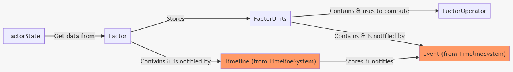

# Developers

Get the full documentation of the [API here](Api.md).

<!-- TOC -->

-   [1. Dependencies](#1-dependencies)
    -   [1.1. for docs](#11-for-docs)
-   [2. Design decisions](#2-design-decisions)
    -   [2.1. Core & UE4 separation](#21-core--ue4-separation)
-   [3. How to override, create my own Event, Timeline, etc...](#3-how-to-override-create-my-own-event-timeline-etc)
    -   [3.1. TimelineManager](#31-timelinemanager)
    -   [3.2. Timeline](#32-timeline)
    -   [3.3. Event](#33-event)
-   [4. Special case: Load game](#4-special-case-load-game)
    -   [4.1. Create USaveGame Object](#41-create-usavegame-object)
    -   [4.2. Copy/Paste to override UE functions](#42-copypaste-to-override-ue-functions)
    -   [4.3. Trigger Save/Load](#43-trigger-saveload)
-   [5. Testing](#5-testing)
    -   [5.1. Make Google Tests works](#51-make-google-tests-works)
-   [6. Contributing](#6-contributing)

<!-- /TOC -->

<a id="markdown-1-dependencies" name="1-dependencies"></a>

## 1. Dependencies

<a id="markdown-11-for-docs" name="11-for-docs"></a>

### 1.1. for docs

-   [node](https://nodejs.org/en/download/) + npm (installed by default with node-js)
-   [Doxygen](http://www.doxygen.nl/download.html)

> [What I used for API documentation](https://sourcey.com/articles/generating-beautiful-cpp-markdown-documentation-with-moxygen)

<a id="markdown-2-design-decisions" name="2-design-decisions"></a>

## 2. Design decisions

My goal was to create the most extensible plugin as possible and keep things simple and readable as inspired by [separation of concerns](https://en.wikipedia.org/wiki/Separation_of_concerns) philosophy and [SOLID principles](https://en.wikipedia.org/wiki/SOLID).

<a id="markdown-21-core--ue4-separation" name="21-core--ue4-separation"></a>

### 2.1. Core & UE4 separation

**> Core** module manage every "basic" functionnalities:

-   it manipulates basics data
-   it is a lightweight library with the less dependencies as possible (only **Core** UE4 modules)
-   it provides basics interfaces or abstract classes to work with
-   it can be build for simple project as **program** build instead of **game** build (to run fast unit tests for example, see [UE4-TPL-CppWithTestEnv](https://github.com/NansPellicari/UE4-TPL-CppWithTestEnv) for an "how to")

**> UE4** module is a more high level paradigm:

-   it is the bridge from **Core** library to **UE4 Editor** and **Game** program
-   it provides more complex implementations of **Core** interfaces or abstract classes thanks to a bunch of [decorators](https://refactoring.guru/design-patterns/decorator) or [adapters](https://refactoring.guru/design-patterns/adapter) to fit with general **game needs**.
-   it provides **configs** & **UI** (blueprints) for editor manipulations
-   it manages **serialization** for the whole system
-   it provides an interface for your **GameInstance** to work with the [FactorsFactoryClient](../Source/NansFactorsFactoryUE4/Public/FactorsFactoryClient.h) object, this makes the glue with configurations, blueprint functions and serialization for savegame.

## Implementation details

-   there is a [proto in javascript](../JsProto/proto.js) to test quickly the system
-   Core [Class diagram](./Core/ClassDiagram.md) (TODO update them)

## 3. How to override, create my own Factor Unit, Factor Event, Operator, etc...

First, I create the whole structure to be the most extensible.  
To doing it, we have to consider **4** basics elements:



> To get more details, you can read the [README definitions](../README.md#3-definitions) section.

Each of these **Core** classes in `Source/NansFactorsFactoryCore` have their **decorator(s)** in the `Source/NansFactorsFactoryUE4`.  
The most preferable way to extend them, it's to create your own decorators or override existants decorators.

<a id="markdown-31-timelinemanager" name="31-timelinemanager"></a>

### 3.1. FactorState

TODO: Improve the system to allow it

### 3.1. Factor

TODO make it possible to use overrides in the system...

<a id="markdown-32-timeline" name="32-timeline"></a>

### 3.2. FactorUnit

The best way is to extend this base class [FactorUnitAdapterAbstract.h](../Source/NansFactorsFactoryUE4/Public/FactorUnit/FactorUnitAdapterAbstract.h). You can extend it with only a Blueprint or in C++.

<a id="markdown-33-event" name="33-event"></a>

### 3.3. FactorEvent

You can extend this base class [FactorEventDecorator.h](../Source/NansFactorsFactoryUE4/Public/Event/FactorEventDecorator.h). You can extend it with only a Blueprint or in C++.

TODO: add possibility to choose the event class in the "create Factor" node

### 3.3. FactorOperator

TODO: Improve this to alow overrides

<a id="markdown-4-special-case-load-game" name="4-special-case-load-game"></a>

## 4. Special case: Load game

**Load** is a bit tricky here, because we need to pass a `UWorld` object to the `USaveGame` object to retrieve `UNTimelineManager` from the `UGameInstance`.  
As I explain [here](https://answers.unrealengine.com/questions/958879/what-is-the-best-way-to-populate-usavegame-on-load.html) the actual code (UE4.25) doesn't allow it with the standard approach.

<a id="markdown-41-create-usavegame-object" name="41-create-usavegame-object"></a>

### 4.1. Create USaveGame Object

First you can follow [this UE4 doc page](https://docs.unrealengine.com/en-US/Gameplay/SaveGame/index.html) to create your own.
Then you have to add a public `UObject* WorldContextObject` property and add these lines:

```cpp
// at the top of the file
#include "NansTimelineSystemUE4/Public/TimelineGameInstance.h"
#include "NansFactorsFactoryGameInstanceUE4/Public/FactorsFactoryGameInstance.h"

// in your `Serialize()` method
if (WorldContextObject == nullptr) return;
if (WorldContextObject->GetWorld() == nullptr) return;
UGameInstance* BaseGI = WorldContextObject->GetWorld()->GetGameInstance();
if (BaseGI == nullptr) return;

// To retrieve the c++ layer of the TimelineGameInstance interface
INTimelineGameInstance* GITimeline = Cast<INTimelineGameInstance>(BaseGI);
if (GITimeline == nullptr) return;
GITimeline->GetClient()->Serialize(Ar);

// To retrieve the c++ layer of the FactorsFactoryGameInstance interface
INFactorsFactoryGameInstance* GIFactor = Cast<INFactorsFactoryGameInstance>(BaseGI);
if (GIFactor == nullptr) return;
GIFactor->GetFactorsFactoryClient()->Serialize(Ar);

```

<a id="markdown-42-copypaste-to-override-ue-functions" name="42-copypaste-to-override-ue-functions"></a>

### 4.2. Copy/Paste to override UE functions

> /!\ Important note:  
> Due to UE4 license limitation, I can't copy/paste too much engine's code here.  
> I'll try to give you the most clues as possible to do it on your own.

All the party in question is located in the [UGameplayStatics](https://github.com/EpicGames/UnrealEngine/blob/42d84f7d1f9c2147ad109179f268fd1542b2ccd2/Engine/Source/Runtime/Engine/Private/GameplayStatics.cpp) class.

So first you need to create a custom `UBlueprintFunctionLibrary` and copy/paste [UGameplayStatics::LoadGameFromMemory()](https://github.com/EpicGames/UnrealEngine/blob/42d84f7d1f9c2147ad109179f268fd1542b2ccd2/Engine/Source/Runtime/Engine/Private/GameplayStatics.cpp#L2077) and [UGameplayStatics::LoadGameFromSlot()](https://github.com/EpicGames/UnrealEngine/blob/42d84f7d1f9c2147ad109179f268fd1542b2ccd2/Engine/Source/Runtime/Engine/Private/GameplayStatics.cpp#L2150) on your project side.

-   `LoadGameFromSlot()` is the blueprint function you will call on the editor side. In its declaration, you need to add a WorldContext Parameter:

```cpp
// In .h file
UFUNCTION(..., meta = (WorldContext = "WorldContextObject",...))
... LoadGameFromSlot(UObject* WorldContext,...);
// In .cpp file you need to call your LoadGameFromMemory() with this object as parameter
LoadGameFromMemory(...,WorldContext WorldContextObject);
```

-   `LoadGameFromMemory()` is the c++ function that `LoadGameFromSlot()` should call and this is where you can add the world to the `USaveGame` object. Just between the [USaveGame instanciation](https://github.com/EpicGames/UnrealEngine/blob/42d84f7d1f9c2147ad109179f268fd1542b2ccd2/Engine/Source/Runtime/Engine/Private/GameplayStatics.cpp#L2102) and the call of [Serialize()](https://github.com/EpicGames/UnrealEngine/blob/42d84f7d1f9c2147ad109179f268fd1542b2ccd2/Engine/Source/Runtime/Engine/Private/GameplayStatics.cpp#L2105) method you need to add:

```cpp
// USaveGame instanciation
OutSaveGameObject->WorldContextObject = WorldContextObject;
// USaveGame::Serialize() call
```

And because life is not so easy, unfortunatly you have to copy/paste and include other dependencies...

First in your cpp header:

```cpp
#include "Misc/EngineVersion.h"
#include "Runtime/Engine/Classes/Kismet/GameplayStatics.h"
#include "Serialization/ObjectAndNameAsStringProxyArchive.h"
```

and from the [UGameplayStatics](https://github.com/EpicGames/UnrealEngine/blob/42d84f7d1f9c2147ad109179f268fd1542b2ccd2/Engine/Source/Runtime/Engine/Private/GameplayStatics.cpp) you have to copy:

-   the static var [UE4_SAVEGAME_FILE_TYPE_TAG](https://github.com/EpicGames/UnrealEngine/blob/42d84f7d1f9c2147ad109179f268fd1542b2ccd2/Engine/Source/Runtime/Engine/Private/GameplayStatics.cpp#L52)
-   the full struct [FSaveGameFileVersion](https://github.com/EpicGames/UnrealEngine/blob/42d84f7d1f9c2147ad109179f268fd1542b2ccd2/Engine/Source/Runtime/Engine/Private/GameplayStatics.cpp#L75)

In [this post](https://answers.unrealengine.com/questions/958879/what-is-the-best-way-to-populate-usavegame-on-load.html) I've suggested 2 ways to simplify this process, but I still don't have any response.

<a id="markdown-43-trigger-saveload" name="43-trigger-saveload"></a>

### 4.3. Trigger Save/Load

Now you can use you special function to load game:


<a id="markdown-5-testing" name="5-testing"></a>

## 5. Testing

They are 2 kinds of tests in this project:

-   [Google Test](https://github.com/google/googletest/) for **unit test** the core lib.
-   [UE4 automation tests](https://docs.unrealengine.com/en-US/Programming/Automation/TechnicalGuide/index.html) which I use more like **functionnal test** here.

In my workflow I use this project template https://github.com/NansPellicari/UE4-TPL-CppWithTestEnv to simplify all the testing settings, tests launches and to get nice reports.  
I invite you to using it if you want to [contribute](#6-contributing) to this project or quick testing these features.

<a id="markdown-51-make-google-tests-works" name="51-make-google-tests-works"></a>

### 5.1. Make Google Tests works

After installing the https://github.com/NansPellicari/UE4-TPL-CppWithTestEnv following the [Step by step guide](https://github.com/NansPellicari/UE4-TPL-CppWithTestEnv#3-step-by-step-guide), you have to download this repo and dependencies as git submodules using this:

```powershell
# in your project root folder
git submodule add https://github.com/NansPellicari/NansUE4TestsHelpers .\Plugins\NansUE4TestsHelpers
git submodule add https://github.com/NansPellicari/UE4-NansCoreHelpers .\Plugins\NansCoreHelpers
git submodule add https://github.com/NansPellicari/UE4-NansTimelineSystem .\Plugins\NansTimelineSystem
git submodule add https://github.com/NansPellicari/UE4-NansFactorsFactory .\Plugins\NansFactorsFactory
# this to place in the right directory and rename correctly
# the plugin's folder to avoid UE4 misconfiguration.
```

After that you just have to link tests located into the `GGTest` folder of the plugin from the **GoogleTestApp project** test's entry point like this:

```cpp
// in Source/Tests/GoogleTestApp/Private/Test.cpp
#define WITH_GG_TESTS = 1
#include "../../../Plugins/NansFactorsFactory/Source/GGTest/Factor.test.cpp"
#include "../../../Plugins/NansFactorsFactory/Source/GGTest/FactorOperator.test.cpp"
#include "../../../Plugins/NansFactorsFactory/Source/GGTest/FactorState.test.cpp"
#include "../../../Plugins/NansFactorsFactory/Source/GGTest/FactorUnit.test.cpp"
#include "../../../Plugins/NansFactorsFactory/Source/GGTest/FactorsFactoryClient.test.cpp"
#include "../../../Plugins/NansFactorsFactory/Source/GGTest/ResetOperator.test.cpp"
#include "../../../Plugins/NansTimelineSystem/Source/GGTest/Timeline.test.cpp"
```

And that it!

<a id="markdown-6-contributing" name="6-contributing"></a>

## 6. Contributing

You are very welcome if you want to contribute.
I explain in [CONTRIBUTING.md](../CONTRIBUTING.md) what is the most comfortable way to me you can contribute.
