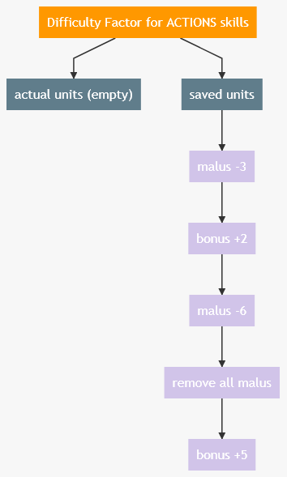

# How does it work

For simplicity sake, here an example of how **1** factor live during a level session.

## Factor is initiliazed

| Step                  | timeline time | what happen                                                                                                                                                                                                                                                                                                                | &nbsp; &nbsp; &nbsp; &nbsp; &nbsp; &nbsp; &nbsp; &nbsp; &nbsp; &nbsp; &nbsp; &nbsp;&nbsp; &nbsp; &nbsp; &nbsp; &nbsp; &nbsp;&nbsp; &nbsp; &nbsp; &nbsp; &nbsp; &nbsp; &nbsp; &nbsp; &nbsp; &nbsp; &nbsp; &nbsp; &nbsp; &nbsp; &nbsp;&nbsp; &nbsp; &nbsp; &nbsp; &nbsp; &nbsp;&nbsp; &nbsp; &nbsp; &nbsp; &nbsp; &nbsp; &nbsp; &nbsp; &nbsp; &nbsp; &nbsp; &nbsp; &nbsp; &nbsp; &nbsp;&nbsp; &nbsp; &nbsp; &nbsp; &nbsp; &nbsp; image &nbsp; &nbsp; &nbsp; &nbsp; &nbsp; &nbsp; &nbsp; &nbsp; &nbsp; &nbsp; &nbsp; &nbsp; &nbsp; &nbsp; &nbsp;&nbsp; &nbsp; &nbsp; &nbsp; &nbsp; &nbsp;&nbsp; &nbsp; &nbsp; &nbsp; &nbsp; &nbsp; &nbsp; &nbsp; &nbsp; &nbsp; &nbsp; &nbsp; &nbsp; &nbsp; &nbsp;&nbsp; &nbsp; &nbsp; &nbsp; &nbsp; &nbsp;&nbsp; &nbsp; &nbsp; |
| --------------------- | ------------- | -------------------------------------------------------------------------------------------------------------------------------------------------------------------------------------------------------------------------------------------------------------------------------------------------------------------------- | :---------------------------------------------------------------------------------------------------------------------------------------------------------------------------------------------------------------------------------------------------------------------------------------------------------------------------------------------------------------------------------------------------------------------------------------------------------------------------------------------------------------------------------------------------------------------------------------------------------------------------------------------------------------------------------------------------------------------------------------------------------: |
| Factor is initiliazed | 0secs         | Ok the game is launched, the factor came to life, and it is rely to a `Level Life timeline`, means a timeline which clear everything (time amount, attached event,etc...) when level ends.                                                                                                                                 |                                                                                                                                                                                                                                                                                                                                                                                                                                                                                                                                                                                                                                                                           |
| Player is injured     | 10secs        | 10secs Passed and player jumped but land to low. One of his leg is broken! Developper can add a new `FactorUnit` (purple blocks).  :grey_question: As you can see, every time a `FactorUnit` is created, the factor saves its data in a dedicated queue. This queue is aimed to get some stats, feedbacks, or whatever. |                                                                                                                                                                                                                                                                                                                                                                                                                                                                                                                                                                                                                                                                                                                      |
| Player try to heal    | 60secs        | Enemies are too dangerous, it's time to use a first aid kit!                                                                                                                                                                                                                                                               |                                                                                                                                                                                                                                                                                                                                                                                                                                                                                                                                                                                                                                                                                                                      |
| 30 secs passed        | 90secs        | player look the wonderful handmade landscape... soiled by the blood of enemies!! 30secs have passed so the first aid bonus has expired.  :grey_question: Then you can see the data of the first `FactorUnit` is saved but it is removed from the `actua units` queue.                                                   |                                                                                                                                                                                                                                                                                                                                                                                                                                                                                                                                                                                                                                                                                                                      |
| Surprise attack       | 95secs        | Oh no player reacts to late, 1 of his arms is broken now!!                                                                                                                                                                                                                                                                 |                                                                                                                                                                                                                                                                                                                                                                                                                                                                                                                                                                                                                                                                                                                      |
| Time to really heal   | 115secs       | Ouch another enemies group coming, they are a lot!! I need to heal fast and take a bonus                                                                                                                                                                                                                                   |                                                                                                                                                                                                                                                                                                                                                                                                                                                                                                                                                                                                                                                                                                                      |
| level ends            | 155secs       | Ok before every thing is cleaned up, developer can retrieve the **saved unit** and make feedbacks, stats, ...                                                                                                                                                                                                              |                                                                                                                                                                                                                                                                                                                                                                                                                                                                                                                                                                                                                                                                                                                      |
