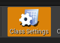
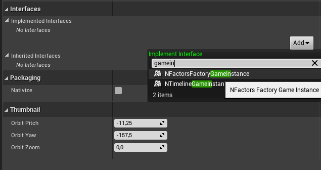
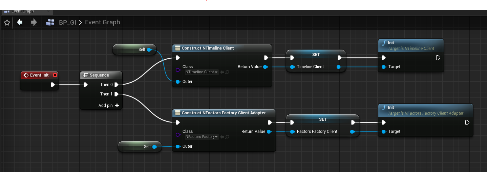
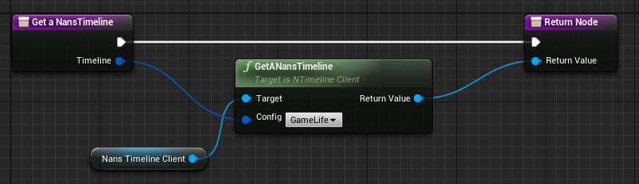
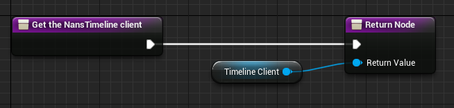
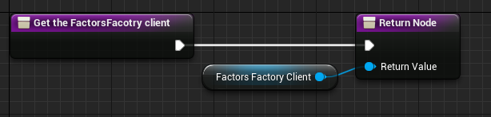
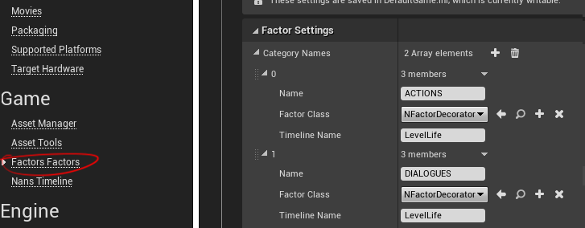
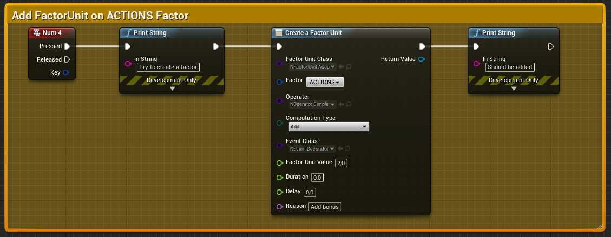
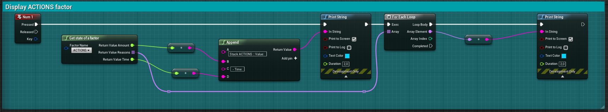

# Getting started - a step by step guide

First you should follow the [NansTimelineSystem: Getting started - a step by step guide](https://github.com/NansPellicari/UE4-TimelineSystem/blob/master/Docs/StepByStep.md).

<!-- TOC -->

-   [1. Installation](#1-installation)
    -   [1.1. Clone plugins](#11-clone-plugins)
    -   [1.2. Add plugin in your game dependencies](#12-add-plugin-in-your-game-dependencies)
    -   [1.3. Use FactorsFactoryGameInstance and FactorsFactoryClient](#13-use-factorsfactorygameinstance-and-factorsfactoryclient)
-   [2. Usages](#2-usages)
    -   [2.1. Configure Timelines](#21-configure-timelines)
    -   [2.2. Configure Factors](#22-configure-factors)
    -   [2.3. Alter Factor (Add FactorUnit)](#23-alter-factor-add-factorunit)
    -   [2.4. Retrieve Factor State](#24-retrieve-factor-state)

<!-- /TOC -->

<a id="markdown-1-installation" name="1-installation"></a>

## 1. Installation

<a id="markdown-11-clone-plugins" name="11-clone-plugins"></a>

### 1.1. Clone plugins

First, you need to clone dependencies repos in your project's `Plugins` directory:

```powershell
cd .\Plugins\

git clone https://github.com/NansPellicari/UE4-FactorsFactory NansFactorsFactory
# /!\ renaming destination folder is important, because UE4 doesn't like dash in project name

# or in your root dir if you already use git for your project

git submodule add https://github.com/NansPellicari/UE4-FactorsFactory ./Plugins/NansFactorsFactory
```

You have to clone dependencies too:

```powershell
# still in .\Plugins\ dir
git clone https://github.com/NansPellicari/UE4-TestsHelpers.git NansUE4TestsHelpers
git clone https://github.com/NansPellicari/UE4-CoreHelpers.git NansCoreHelpers
git clone https://github.com/NansPellicari/UE4-TimelineSystem.git NansTimelineSystem

# or in your root dir if you already use git for your project
git submodule add https://github.com/NansPellicari/UE4-TestsHelpers.git ./Plugins/NansUE4TestsHelpers
git submodule add https://github.com/NansPellicari/UE4-CoreHelpers.git ./Plugins/NansCoreHelpers
git submodule add https://github.com/NansPellicari/UE4-TimelineSystem.git ./Plugins/NansTimelineSystem
```

<a id="markdown-12-add-plugin-in-your-game-dependencies" name="12-add-plugin-in-your-game-dependencies"></a>

### 1.2. Add plugin in your game dependencies

In your `<MyProject>.uproject` file add these lines:

```json
{
	// other configs here ...
	"Plugins": [
		{
			"Name": "NansFactorsFactory",
			"Enabled": true
		},
		{
			"Name": "NansTimelineSystem",
			"Enabled": true
		},
		{
			"Name": "NansUE4TestsHelpers",
			"Enabled": true
		},
		{
			"Name": "NansCoreHelpers",
			"Enabled": true
		}
	]
}
```

in your `Source/<MyProject>.Target.cs` and `Source/<MyProject>Editor.Target.cs`:

```csharp
ExtraModuleNames.AddRange(new string[] {
    // Other dependencies here ...
    "NansUE4TestsHelpers",
    "NansCoreHelpers",
    "NansTimelineSystemCore",
    "NansTimelineSystemUE4",
    "NansFactorFactoryCore",
    "NansFactorFactoryUE4"
});
```

And be sure to have these in your project public dependencies (in `Source/<MyProject>/<MyProject>.Build.cs`):

```csharp
PublicDependencyModuleNames.AddRange(new string[] {
    "Core",
    "CoreUObject",
    "Engine",
    "InputCore",
    "KismetCompiler",
    "NansCoreHelpers",
    "NansTimelineSystemCore",
    "NansTimelineSystemUE4",
    "NansFactorFactoryCore",
    "NansFactorFactoryUE4"
});
```

<a id="markdown-13-use-factorsfactorygameinstance-and-factorsfactoryclient" name="13-use-factorsfactorygameinstance-and-factorsfactoryclient"></a>

### 1.3. Use FactorsFactoryGameInstance and FactorsFactoryClient

`UNFactorsFactoryGameInstance` is an interface you can use with blueprint or c++:

**> Blueprint**

First create a new Blueprint which inherit from a `UGameInstance` and open blueprint **class settings**:



Add the `NFactorsFactoryGameInstance` & `NTimelineGameInstance` interface:



Follow the [NansTimelineSystem: Step by step guide](https://github.com/NansPellicari/UE4-TimelineSystem/blob/develop/Docs/StepByStep.md) to implements necessary function for the `NTimelineGameInstance`.

Override the `UGameInstance::init()` method + add 2 new variables:

-   1 of `NTimelineClient` type
-   1 of `NFactorsFactoryClient` type



Override the `NTimelineClient` interface method:





Override the `NFactorsFactoryClient` interface method:



**> c++**

Here an example of a `UGameInstance` class which implements it:

```cpp
// I regroup all in MyGameInstance.h file for simplicity sake.
#pragma once

#include "CoreMinimal.h"
#include "Engine/GameInstance.h"
#include "NansFactorsFactoryUE4/Public/FactorsFactoryClientAdapter.h"
#include "NansFactorsFactoryUE4/Public/FactorsFactoryGameInstance.h"
#include "NansTimelineSystemUE4/Public/Attribute/ConfiguredTimeline.h"
#include "NansTimelineSystemUE4/Public/Manager/TimelineManagerDecorator.h"
#include "NansTimelineSystemUE4/Public/TimelineClient.h"
#include "NansTimelineSystemUE4/Public/TimelineGameInstance.h"

#include "MyGameInstance.generated.h"

UCLASS()
class UE4FACTORSFACTORY_API UMyGameInstance : public UGameInstance, public INTimelineGameInstance, public INFactorsFactoryGameInstance
{
	GENERATED_BODY()
public:
	UMyGameInstance(){};

	// BEGIN UGameInstance override
	virtual void Init() override
	{
		Super::Init();
		TimelineClient = NewObject<UNTimelineClient>(this, FName(TEXT("MyTimelineClient")));
		TimelineClient->Init();
		FactorsFactoryClient = NewObject<UNFactorsFactoryClientAdapter>(this, FName(TEXT("MyFactorsFactoryClient")));
		FactorsFactoryClient->Init();
	}
	// END UGameInstance override

	// BEGIN INTimelineGameInstance override
	virtual UNTimelineManagerDecorator* GetTimeline_Implementation(FConfiguredTimeline Config) const override
	{
		return TimelineClient->GetTimeline(Config);
	}

	virtual UNTimelineClient* GetTimelineClient_Implementation() const override
	{
		return TimelineClient;
	}
	// END INTimelineGameInstance override

	// BEGIN INFactorsFactoryGameInstance override
	virtual UNFactorsFactoryClientAdapter* GetFactorsFactoryClient_Implementation() const override
	{
		return FactorsFactoryClient;
	}
	// END INFactorsFactoryGameInstance override

protected:
	UPROPERTY()
	UNTimelineClient* TimelineClient;
	UPROPERTY()
	UNFactorsFactoryClientAdapter* FactorsFactoryClient;
};

```

<a id="markdown-2-usages" name="2-usages"></a>

## 2. Usages

<a id="markdown-21-configure-timelines" name="21-configure-timelines"></a>

### 2.1. Configure Timelines

Referer to the [NansTimelineSystem: Getting started - a step by step guide](https://github.com/NansPellicari/UE4-TimelineSystem/blob/develop/Docs/StepByStep.md#21-configure-timelines).

<a id="markdown-22-configure-factors" name="22-configure-factors"></a>

### 2.2. Configure Factors

Go to your **project** settings:



> :exclamation: Be consistent with the previously configured `Timeline name`.

<a id="markdown-23-alter-factor-add-factorunit" name="23-alter-factor-add-factorunit"></a>

### 2.3. Alter Factor (Add FactorUnit)



<a id="markdown-24-retrieve-factor-state" name="24-retrieve-factor-state"></a>

### 2.4. Retrieve Factor State



Enjoy :wink: !
