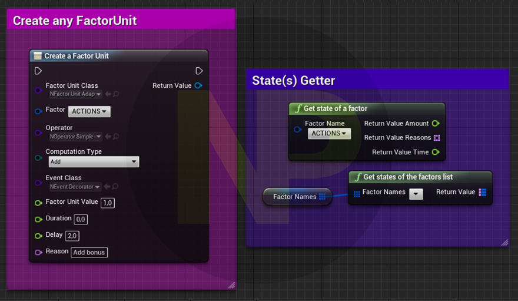

# Factors Factory

Ease and centralized your **factors**1 management, **retrieve** them to get some player **feedbacks/stats** and **serialized** them for **save/load game**.

> 1 A **factor** is a simple stack composed of **unit** objects which embed a **value**, an **operation** instruction and **lifetime** details. It can be used for **Malus** or **Bonus** factor, **difficulty**, ... >> more details in the [What is a factor?](#23-what-is-a-factor) section.

|                                                                                                                                                                                                              |
| :---------------------------------------------------------------------------------------------------------------------------------------------------------------------------------------------------------------------------------------------------------------------------------------------------------------------------------------------------------------------------------------------: |
| I've decided to make all the code I developed for my games free to use and open source.  I am a true believer in the mindset that sharing and collaborating makes the world a better place.  The thing is: I'm fulltime dedicated to my project and these open source plugins, for coding I need a looooot of coffee, so please, help me to get my drug :stuck_out_tongue_closed_eyes: !! |

<!-- TOC -->

-   [1. Requirements](#1-requirements)
-   [2. Usages](#2-usages)
    -   [2.1. Many factors](#21-many-factors)
    -   [2.2. What is a factor?](#22-what-is-a-factor)
        -   [2.2.1. - UNIT](#221---unit)
        -   [2.2.2. - FACTOR](#222---factor)
        -   [2.2.3. - STATE](#223---state)
    -   [2.3. When & Where? Ease of use](#23-when--where-ease-of-use)
-   [3. How does it work?](#3-how-does-it-work)
-   [4. Step by step guide](#4-step-by-step-guide)
-   [5. Contributing and Supporting](#5-contributing-and-supporting)

<!-- /TOC -->

**>> For developers:**

-   [Developers docs](./Docs/Developers.md)

## 1. Requirements

-   [NansUE4TestsHelpers](https://github.com/NansPellicari/UE4-TestsHelpers) (free UE4 plugins)
-   [NansCoreHelpers](https://github.com/NansPellicari/UE4-CoreHelpers) (free UE4 plugins)
-   [NansTimelineSystem](https://github.com/NansPellicari/UE4-TimelineSystem) (free UE4 plugins)

## 2. Usages

I used this to get a **malus/bonus** system, a **difficulty** factor and an **xp** counter,... sky is the limit!  
The factors factory helps you to create any factor and update or retrieve it **where** and **when** you want.

### 2.1. Many factors

For instance in my game I needed:

-   **differents** difficulty **factors** for **AIMING** ability and for a **SOCIAL** skill
-   **differents timeline** for factors: some needs to work during the **level process** (eg "Oh player is drunk, for 1 minutes during the game session he should be affected! :confused: Alcohol ravages..."), others during the **real life timeline** (eg. "Hey bro, thanks to your fidelity, I give you 2 days of bonus on social interactions :kissing_heart:"), etc...
-   using the same simple **UI** to **alter** a factor

So basically a Factor as a **name** and it is attached to a **Timeline** and can be **updated** in **any moment** and **everywhere**.

> **Be aware of**: When a timeline ends, all attached factors will be reset.

### 2.2. What is a factor?

In this plugin I categorized factor in **3 units of work**:

#### 2.2.1. - UNIT

The related class object is named `FactorUnit`.  
This is what designers or developpers want to **add on the fly** as a factor's variator (or alterator).  
Eg.

> 1. Player eat a rotten fruit = **reduce** the **ACTION** capacity's **factor** to **2** after **100 secs** of digestion.
> 2. Player drink alcohol = **divide** actual factor by **4** on **SPEECH** capacity after **50 secs** of absorption.
> 3. Player make a benevolent action = **add** a bonus of **10** on **SOCIAL** skill's **factor**.

A factor **UNIT** is basically composed of:

| A Reason                                                                                            | A Value                                | An Operator                                                                                             | A Duration                                                                                                   | A Delay                                     |
| --------------------------------------------------------------------------------------------------- | -------------------------------------- | ------------------------------------------------------------------------------------------------------- | ------------------------------------------------------------------------------------------------------------ | ------------------------------------------- |
| Is the **Why** this factor appears (can be used to send feedback to player, to make some stats,...) | **What** amount/degree of factor it is | **How** the value is computed with previous units in the same factor (or `FactorUnit` stack, see below) | Duration of this unit is applied (it is removed for computation after that but saved for stats or feedbacks) | To schedule the start before a unit applies |
| **Using last examples:**                                                                            |
| 1. eat rotten fruit                                                                                 | 2                                      | Substract (**reduce** = **malus** = the inverse of **adding** a **bonus**)                              | 300secs                                                                                                      | 100secs                                     |
| 2. drunk                                                                                            | 4                                      | Divide                                                                                                  | 200sec                                                                                                       | 50secs                                      |
| 3. benevolent action                                                                                | 10                                     | Add                                                                                                     | 2 days (you can convert in seconds... :smirk:)                                                               | 0                                           |

#### 2.2.2. - FACTOR

A factor is **named** (eg. **ACTION**, **ELOQUENCE**, **REFLEXE**, **SociaL**, **WhatEver**... you decide) to retrieve them easily.  
As designer or developper you can create an **infinite list** of factors and add as many units you want.  
All factors are created in **project settings**.  
A factor relies on a timeline (configured in **project settings** too).  
A factor is a **queue of units**, it saves them no matters their lifetime (for serialization, but not included for state computation) so you can use it to:

-   sends reports
-   gives feedbacks to the player afterwards
-   save them on saved games

#### 2.2.3. - STATE

This is the **state** of a factor at a **given time**.  
Every time you ask to get a state, you will have a static state of the factor value, reasons list implied on computation (all units reasons reduce to get a unique reasons list), and the current time you asked for it (depending on the timeline paradigm).

### 2.3. When & Where? Ease of use

As a designer and a developper I wanted to:

| Needs                                                                                                             | What is my solution                                                                                                                                                                                                                                                                                                                         |
| ----------------------------------------------------------------------------------------------------------------- | ------------------------------------------------------------------------------------------------------------------------------------------------------------------------------------------------------------------------------------------------------------------------------------------------------------------------------------------- |
| Alter a factor in any moment and in every single part of the game (eg. Behavior tree, Blueprint, c++ classes,...) | **1** single **API entry point** saved in the **Game Instance**                                                                                                                                                                                                                                                                             |
| Don't have to use my brain too much...                                                                            | **3 mains blueprints nodes** to manage all of this (**create** units & **get** factor's value).                                                                                                                                                                                                                                             |
| Easily extend it later                                                                                            | Simple architecture in isolated plugins, use a bunch of interfaces (lot of extension possibility see [Developers: How to override ...](./Docs/Developers.md#4-how-to-override-create-my-own-factor-factor-unit--operator) and a lot of tests/specs (see [Developers: Testing](./Docs/Developers.md#6-testing) section) to avoid regression. |

## 3. How does it work?

To maintain a short doc here, please read this page [here](./Docs/How-does-it-work.md)

## 4. Step by step guide

To maintain a short doc here, please read this page [here](./Docs/StepByStep.md)

## 5. Contributing and Supporting

I've decided to make all the code I developed for my games free to use and open source.  
I am a true believer in the mindset that sharing and collaborating makes the world a better place.  
I'll be very glad if you decided to help me to follow my dream.

| How?                                                                                                                                                                               |                                                                                         With                                                                                         |
| :--------------------------------------------------------------------------------------------------------------------------------------------------------------------------------- | :----------------------------------------------------------------------------------------------------------------------------------------------------------------------------------: |
| **Donating**  Because I'm an independant developer/creator and for now I don't have  any income, I need money to support my daily needs (coffeeeeee).                        |  |
| **Contributing**  You are very welcome if you want to contribute. I explain [here](./CONTRIBUTING.md) in details what  is the most comfortable way to me you can contribute. |                                                                         [CONTRIBUTING.md](./CONTRIBUTING.md)                                                                         |
